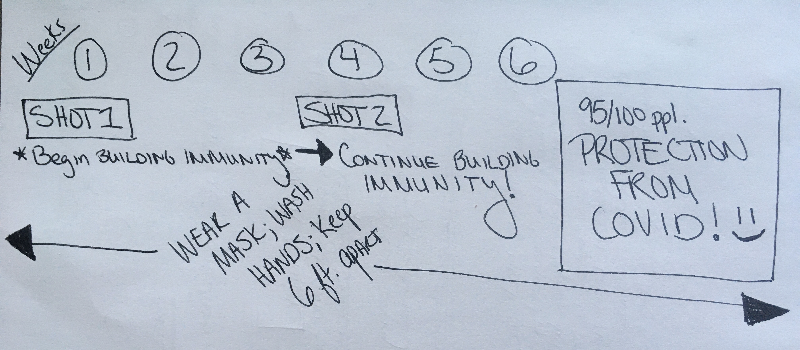

I’m going to break this into a short and a long answer, with the short answer first. This could get really technical and I want to do my best to make sure it’s clear and I also don’t want to overwhelm you with jargon. We're not getting into herd immunity today; I'm just going to focus on what we need to know as individuals to protect our community while vaccines are still being rolled out. I think you’re cool and that it’s cool you’re curious. Please keep reaching out with questions! I’m not the COVID police and I promise that I’m not here to judge anyone who is skeptical or uncertain. We're all just doing the best we can and hopefully [layering up protections to reduce risk.](https://dradrian.netlify.app/post/risk_vs_safety/) So, why precautions matter even if some of us have been vaccinated or already had COVID:

**Short answer:**
- Even if you don’t get COVID symptoms (because you already had COVID or you’ve already been vaccinated), it’s still possible that you could pass SARS-CoV-2 to others who aren’t protected. 
- Following vaccination, it takes weeks for the body to build immunity (you also need to make sure you get both doses if you’re getting an mRNA vaccine)
- Keep wearing your mask, washing your hands, and staying 6 ft. from others who you don't live with when possible.

I drew a rough timeline; hope it helps:

**Longer answer:**
At this time, we know that people who have been infected with SARS-CoV-2 and experienced COVID *can* get reinfected with SARS-CoV-2. It’s happened in cases where individuals had mild symptoms the second time around, but it’s also happened that folks have gotten sicker the second time they had COVID. Since everyone has a unique immunological background that has developed based on things they’ve been exposed to in the past, their unique genetics, and other variables, everybody’s immune response looks a little different. Because of this, we can expect that some people will have an absolutely protective immune response following natural infection, but others will not. It also depends how much virus a person was exposed to, which varies *a lot*. Vaccination with an mRNA vaccine focuses the immune response on the most important part of the virus, which is why we will see **better, longer protection** from disease following vaccination than following natural infection. 95% efficacy means that only a very small fraction people who get vaccinated will remain susceptible. You’ll be given specific instructions about when to come back for a 2nd dose when you first get vaccinated, and you need to know that your body needs time to develop robust immunity after you’ve been vaccinated with both doses. During those weeks, you will develop a supply of T cells and B cells that will remember what SARS-CoV-2 looks like if you get exposed in the future. [More about how vaccines work here.](https://www.cdc.gov/coronavirus/2019-ncov/vaccines/different-vaccines/how-they-work.html?CDC_AA_refVal=https%3A%2F%2Fwww.cdc.gov%2Fcoronavirus%2F2019-ncov%2Fvaccines%2Fabout-vaccines%2Fhow-they-work.html)

Now, about vaccine-mediated immunity: Something that I didn’t wrap my head around until graduate school is that some vaccines protect from disease but don’t protect against infection. This means that we will not get sick, but we could still get infected and cause others in our circles to get sick if they have not been vaccinated already (for example, this is one reason why we worry about unknowingly giving whooping cough to babies before they’ve been vaccinated). Vaccinated and protected people won’t need to worry about the complications that come with COVID if they’re exposed to SARS-CoV-2, but they do need to be aware that they could possibly pass disease to others after being around someone who has COVID. I want to be clear that **vaccination cannot give you COVID; people infected with SARS-CoV-2 can give you COVID.** We may learn during the coming months if the vaccine protects both infection and disease, but right now there is too great a cost in assuming what it does without proof. Until everyone has the chance to get vaccinated and we approach herd immunity — regardless of your vaccination status or recovery from COVID — it’s important to continue to stay 6 ft. or more away from folks who aren’t in your household if possible, to wear a mask in public, and to use hand sanitizer/wash your hands with soap and water. These simple things are still important and aren’t for nothing because they protect your community until everyone’s had a chance to get vaccinated.