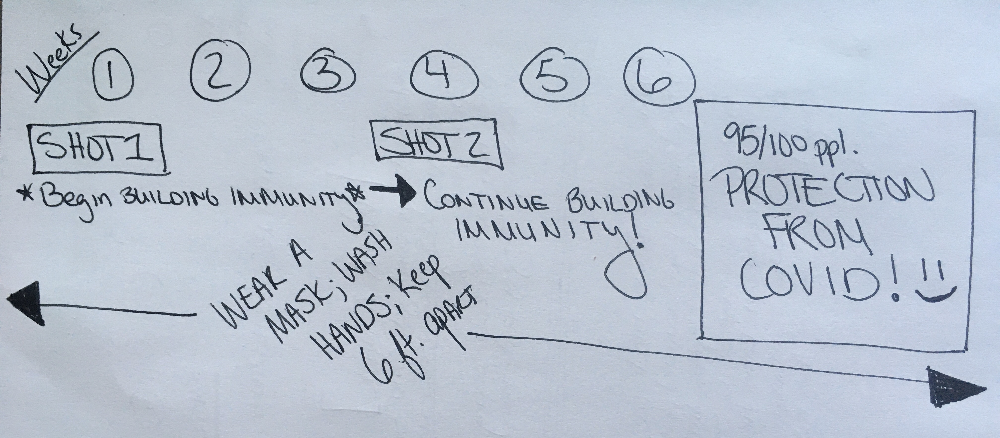

The mRNA vaccines produced by Moderna and Pfizer require **2 doses** for full immunity to take effect. If someone was exposed to SARS-CoV-2 prior to becoming vaccinated, or even during the period between the 1st shot and ~2 weeks after the 2nd shot, they could *still get COVID*. These folks do not have COVID because of the vaccine, but rather because they were exposed before their body had a chance to develop immunity in response to the vaccine. Another element to consider is that a very small percentage of folks will not develop full immunity for genetic reasons, and this is one of the reasons it’s important to vaccinate as much of the population as possible to reach herd immunity and [keep wearing masks.](https://dradrian.netlify.app/post/keep_wearing_masks/)
I'll post my rough timeline sketch again:

