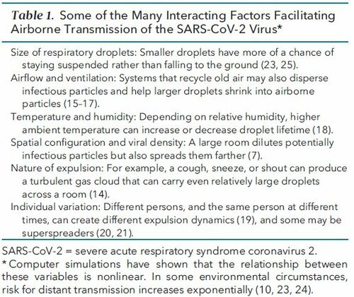

This is something I think a lot of us struggle with. If I had all the resources and could put my cancer-warrior, immunocompromised, or otherwise at-risk loved ones each in their own isolated and private villa with room service, *I wouldn’t.* I don’t think that’s good for mental health. On the other hand, if I could cast a magic spell that made everyone around my loved ones (including my loved ones) wear masks properly, always interact in areas with excellent ventilation/airflow, observe good hand and respiratory etiquette, and remain at least 6 ft. away from those not in their household when reasonable, that’s what I’d do. This is as close as I can get to casting that spell, and I pray it works. During the course of 2020 there were times when my mask-wearing compliance was pretty ok at best and my personal thoughts on mask wearing were different from what they are now. One of the things about science is that we constantly re-evaluate and learn based on new data, and the advisory to wear masks is one of the results of learning that SARS-CoV-2 can be airborne. Here I’ll write about some of the info I find compelling, with the hope that it can help you or someone in your circle make a decision about mask-wearing. 

1. Let’s start with one reason that isn’t necessarily scientific, but maybe kind of is. We can’t always tell by looking at someone if they’re immunocompromised. I know plenty of spunky people with asthma, diabetes, autoimmune diseases, cancer — the list goes on — who I would not have known were high-risk just by looking at them. Point 1, we don’t know what we don’t know. It’s really important to layer as much protection as possible around vulnerable people, and those people need to go to the grocery store or take their kids to necessary appointments just the same as anybody else.

2. Even though masks kind of look like face diapers sometimes, you can go so far as to think of their function in the same way. A great benefit of wearing a mask is to keep it all in. “It” being your spit when you get a little excited or spittle when you talk (yes, everyone does that), plus those completely unseeable droplets that come out of your mouth every time you even breathe. We know that those little droplets can actually carry enough virus to make someone sick. That really sucks. Below is a little table summarizing variables that affect droplet spread and you can read the whole article [here](https://www.acpjournals.org/doi/10.7326/M20-6625).

3. There’s something in it for you! There is evidence that wearing non-medical masks (like what is commonly worn in the US right now — mostly homemade or store-bought fabric masks) lowers the risk of severe infection. It’s not clear if that’s because it reduces the number of viral particles that get through the fabric to the wearer, or if others adhere more to good respiratory hygiene when around others who are wearing masks (or are more likely to also wear masks when spending time around people wearing masks because of peer pressure). Either way, you’re less likely to get COVID if you’re wearing a mask. [See just one example study here.](https://pubmed.ncbi.nlm.nih.gov/32931726/)

4. SARS-CoV-2 does not transmit in a uniform fashion. In fact, it was estimated based on data from earlier in the pandemic that only 10% of infected people accounted for as much as 80% of SARS-CoV-2 spread ([read more here](https://wellcomeopenresearch.org/articles/5-67)). We don’t have a great way to know who’s a “superspreader” before they’ve done their superspreading and the damage is done. Therefore, assume you’re the special/unlucky person who has the ability to accidentally infect way more people than you could ever know. In my opinion, it’s kinder to assume we could be the super spreaders and take necessary precautions. Now that a more transmissible variant* is spreading in the US, it’s even more crucial to make sure to take precautions and wear a mask.

*note on the more transmissible variant(s): [England’s public health work](https://www.gov.uk/government/publications/investigation-of-novel-sars-cov-2-variant-variant-of-concern-20201201) has shown that more people who were infected with SARS-CoV-2 in lineage B.1.1.7 spread the virus on to other folks than people who were not infected with a variant of concern. They did this by sequencing a whole bunch of samples and pairing it with contact tracing. Bless those smart teams in the UK who are organized and getting important work done!

I want to point out that my training is in microbiology, and while I’ve sat through many hours of courses in epidemiology I’m definitely not an epidemiologist. If you are curious about disease modeling and human behavior or other non-microbial realms, let me know and I can point you to some resources and experts who can teach you more!